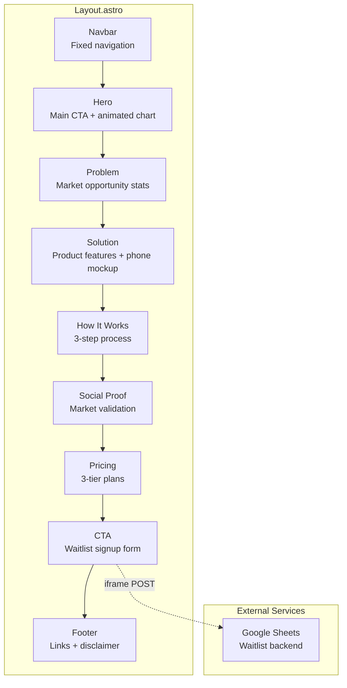

# Growfolio Landing Page

Marketing landing page for Growfolio — a European family investment platform focused on dollar-cost averaging into US stocks.

## Sitemap



## Tech Stack

- **Framework**: [Astro](https://astro.build) (static site generation)
- **Styling**: [Tailwind CSS](https://tailwindcss.com)
- **Deployment**: [Cloudflare Workers](https://workers.cloudflare.com)
- **Typography**: Playfair Display + DM Sans (Google Fonts)

## Commands

| Command           | Action                                   |
| :---------------- | :--------------------------------------- |
| `npm install`     | Install dependencies                     |
| `npm run dev`     | Start dev server at `localhost:4321`     |
| `npm run build`   | Build production site to `./dist/`       |
| `npm run preview` | Preview build locally before deploying   |

## Project Structure

```
src/
├── pages/
│   └── index.astro          # Page entry point
├── layouts/
│   └── Layout.astro         # HTML wrapper + global scripts
├── components/
│   ├── Navbar.astro         # Fixed nav with scroll effect
│   ├── Hero.astro           # Hero section with SVG chart
│   ├── Problem.astro        # Dark stats section
│   ├── Solution.astro       # Features grid + phone mockup
│   ├── HowItWorks.astro     # 3-step numbered process
│   ├── SocialProof.astro    # Market opportunity cards
│   ├── Pricing.astro        # 3-tier pricing cards
│   ├── CTA.astro            # Email waitlist form
│   └── Footer.astro         # Links + legal disclaimer
└── styles/
    └── global.css           # Theme variables + animations
```

## Design Tokens

Colors are defined as CSS variables in `global.css`:

| Variable          | Value     | Usage              |
| :---------------- | :-------- | :----------------- |
| `--color-forest`  | `#1a3a32` | Primary dark green |
| `--color-teal`    | `#3d8b7a` | Accent             |
| `--color-gold`    | `#c9a962` | Highlights         |
| `--color-coral`   | `#d4847c` | Stats/alerts       |
| `--color-cream`   | `#faf8f5` | Light background   |
